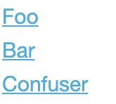
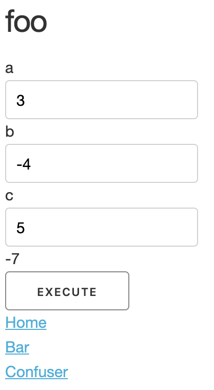
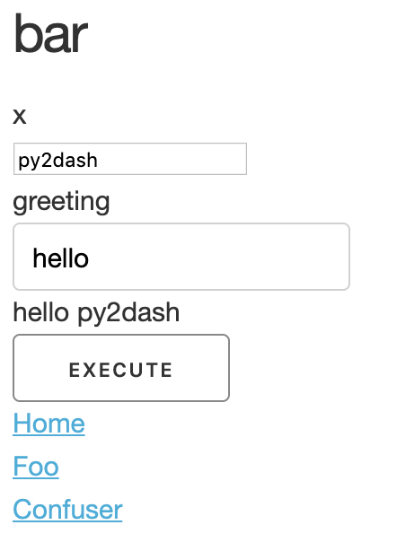
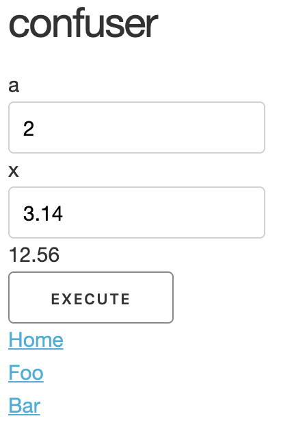
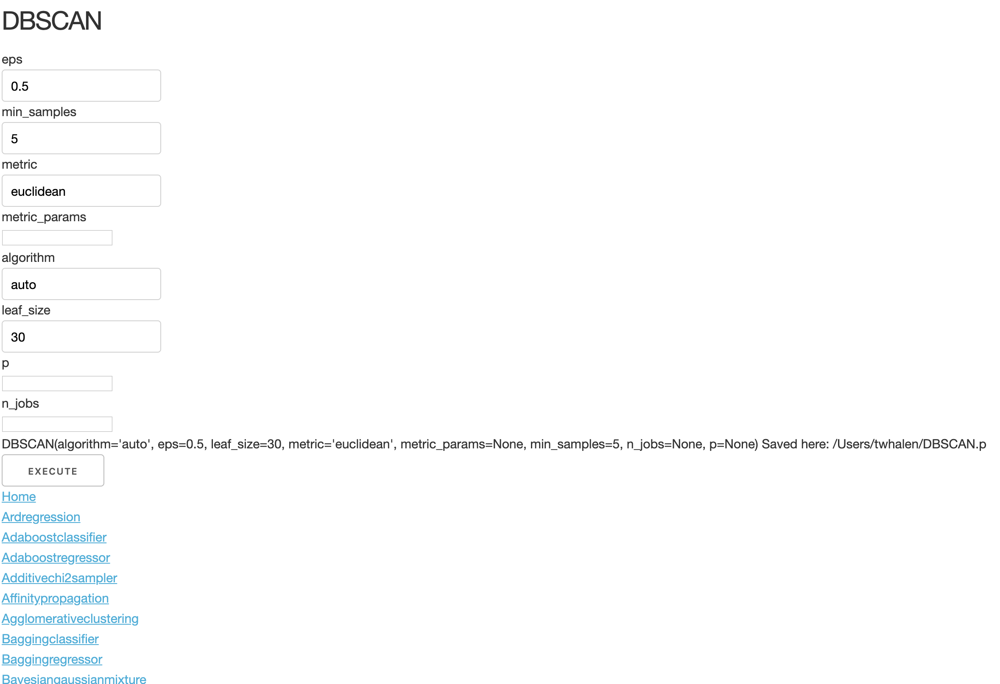

# What's this?

Experimental tools to get you from python functions to a browser based dashboard exhibiting these: That is, allowing you to 
see these functions, select one, see the signature, enter the inputs, call the function, and see the results.

At the time of writing this, it's only a proof of concept. 
Still, it works perfectly if your functions only have simple types, and you're okay with the default choice of layout and output format. As far as the functions being simple, know that you can always rein a function down to compatibility using decorators (see [Example: Dispatching Sklearn](#Example: Dispatching Sklearn))

Yet we obviously want to do more! We want to allow the user to use any function, simply by specifying how complex types should be handled (and doing so with minimal boilerplate). We want to allow a range of possible layouts, navigation structures and output presentations.

# Simple Example

Consider the code below:

```python

def foo(a: int = 0, b: int = 0, c=0):
    """This is foo. It computes something"""
    return (a * b) + c


def bar(x, greeting='hello'):
    """bar greets it's input"""
    return f"{greeting} {x}"


def confuser(a: int = 0, x: float = 3.14):
    return (a ** 2) * x


if __name__ == '__main__':
    from py2dash.app_makers import dispatch_funcs

    app = dispatch_funcs([foo, bar, confuser])
    app.run_server(debug=True)
```

You basically have three functions that are defined. 
The list of these functions are handed to the `dispatch_funcs` function which returns an app object. 
When you call `app.run_server()` then, a server will launch and you'll be given a default url to go to (default is `http://127.0.0.1:8050/`). 

When you go to that url, you'll first see a list of the (clickable) function names.



Click on foo and you'll see `foo`'s name and signature. Enter a few numbers there, click execute, and you get:




Yep. It's alive! Try it again, try it again. Click on `bar` and do something with it...



Again!



Convinced?

# Example: Dispatching Sklearn

The code below will allow the user to select any of the first 50 estimators of [sklearn](https://scikit-learn.org/), parametrize them, and save this in a local pickle file. This provides an example of how we can do a lot more, even with the basics, by decorating the functions 
we wish to dispatch.

```python
from sklearn.utils.testing import all_estimators  # a list of all 197 estimators sklearn offers
from functools import wraps

# make a decorator to save a pickle of the object created locally
def pickle_output(func):
    import os
    import pickle
    func_name = func.__name__
    save_filepath = os.path.expanduser(f"~/{func_name}.p")

    @wraps(func)
    def wrapped(*args, **kwargs):
        obj = func(*args, **kwargs)
        pickle.dump(obj, open(save_filepath, 'wb'))
        return f"{str(obj)} \n\nSaved here: {save_filepath}"

    return wrapped


output_decorator = pickle_output

funcs = [output_decorator(x[1]) for x in all_estimators()[:50]]  # decorate the first 50 estimators

if __name__ == '__main__':
    from py2dash.app_makers import dispatch_funcs
    app = dispatch_funcs(funcs)
    app.run_server(debug=True)
```

Running this code, clicking on DBSCAN, for instance, and clicking on Execute saves a pickle file locally, under `~/DBSCAN.p`.



